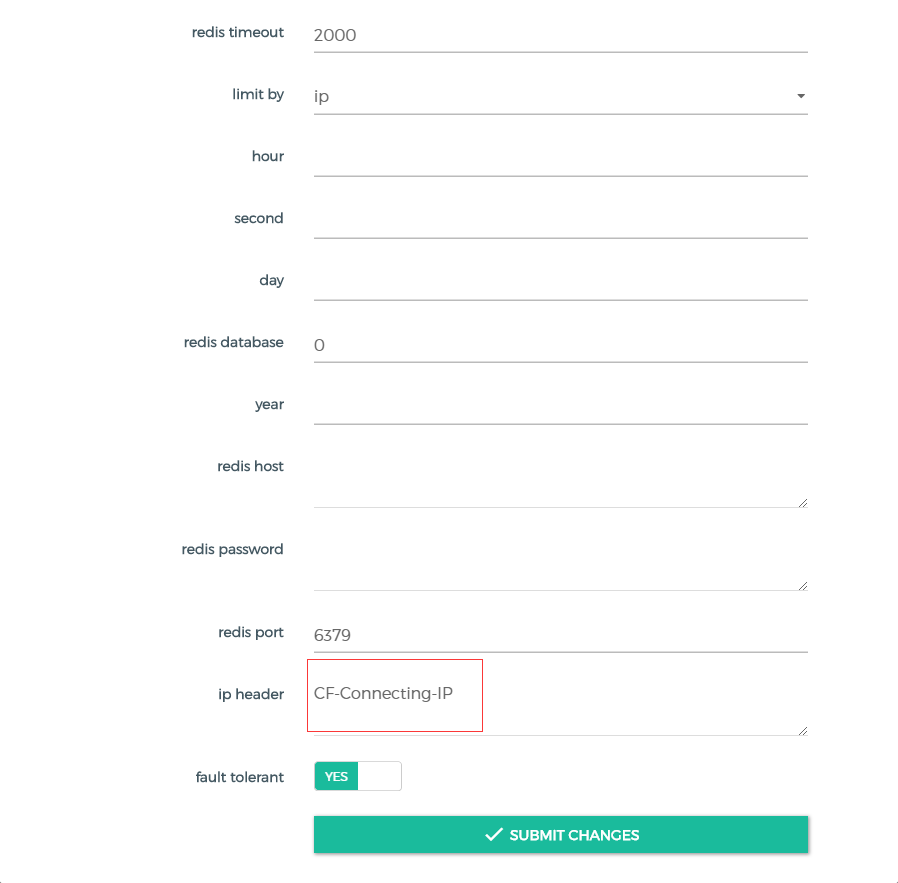
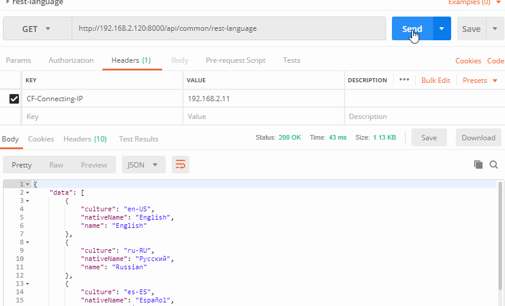

# Rate Limiting Ex

Rate Limiting Ex is the rate limit plugin for kong gateway.Based on official `rate-limiting` plugin, I added a property that can be customized to get the request header for the ip address.

## Get Start

### 1.Install

````shell
git clone https://github.com/stulzq/kong-plugin-rate-limiting-ex.git
cd kong-plugin-rate-limiting-ex
cp src/rate-limiting-ex /usr/local/share/lua/5.1/kong/plugins/
````

### 2.Configuration

```shell
vim /etc/kong/kong.conf
```

find `plugins` option, add the following content:

````
plugins = bundled,rate-limiting-ex
````
Execute command migration database

````shell
kong migrations up
````

Finally restart kong.

### 3.Enable



### 5.Test


